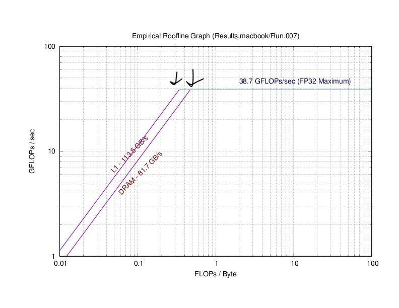
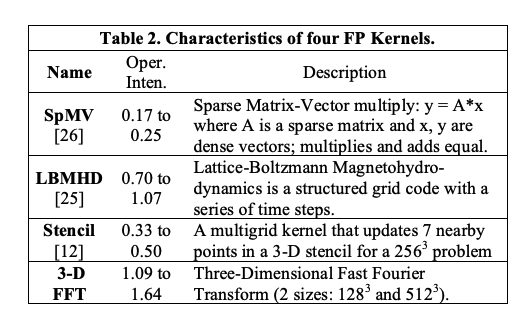
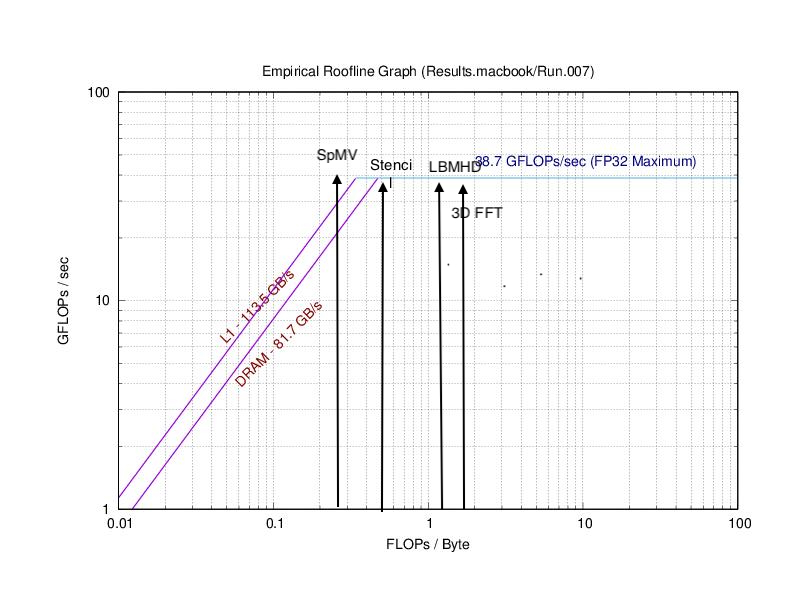
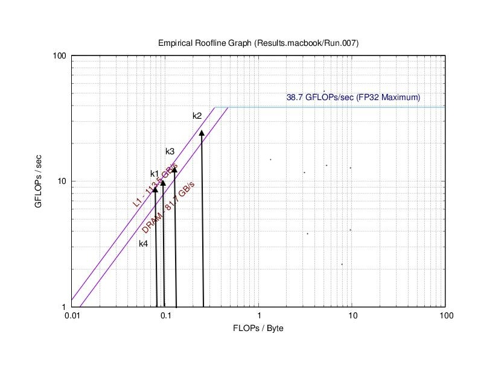

# Project 1

## Warm-up

*Review the section in [HPSC](../assets/EijkhoutIntroToHPC2020.pdf) on computing arithmetic intensity for given compute kernels. 
Then, as a group, compute the arithmetic intensities of the following kernels in units of FLOPs/byte, assuming 8 bytes per float.*

```C
  Y[j] += Y[j] + A[j][i] * B[i]
```

```C
  s += A[i] * A[i]
```

```C
  s += A[i] * B[i]
```

```C
  Y[i] = A[i] + C*B[i]
```

### Solution

| Kernel      | Number of flops | Number of bytes | Arithmetic Intensity $[\frac{flop}{byte}]$|
| ----------- | ----------- | ----------- | ----------- |
| `Y[j] += Y[j] + A[j][i] * B[i]`      |    3    |    32    |    $\frac{3}{32}$    |
| `s += A[i] * A[i]`   |    2    |    8    |    $\frac{1}{4}$    |
| `s += A[i] * B[i]`   |    2    |    16    |    $\frac{1}{8}$    |
| `Y[i] = A[i] + C*B[i]`   |    2    |    24    |    $\frac{1}{12}$    |

## Part 1: Matrix-matrix Multiplication

*In this first part of the project, you will test the performance of the basic matrix-matrix multiplication operation as a function of matrix size on multiple compute platforms. Complete the following using at least two different compute architectures (e.g., your laptop and HPCC, or two different node architectures on HPCC).*

### 1.1 Solution 

Please check the code `Part1.cpp`

### 1.2 Solution 

$2N^{3}$, so if $N=100$, this should be $2000000$. 

### 1.3 Solution 

 We test it for 5 times on two different devices: Mackbook Pro with M1 Pro, and HPCC with amd-dev20. The recorded Mflops/s are given in the table below:

|             | Run 1   | Run 2   | Run 3   | Run 4   | Run 5   | Avg.     |
|-------------|---------|---------|---------|---------|---------|----------|
| Macbook     | 194.744 | 226.09  | 176.833 | 258.996 | 292.571 | 229.8468 |
| Dell XPS 15 | 176.4   | 209.1   | 150.0   | 164.9   | 163.3   | 172.74   |
| HPCC        | 177.229 | 180.361 | 161.226 | 161.422 | 160.797 | 168.207  |

### 1.4 Solution

theoretical peak performance = #cores_per_processors x #clock_speed x 1. 

| System specfication          | Arc1 (Macbook Pro) | Arc2 (Dell XPS 15) | Arc3 (HPCC amd-dev20) |
| ---------------------------- | ------------------ | ------------------ | --------------------- |
| Clock Rate                   | 3.2 GHz            | 2.3 GHz            | 2.6 GHz               |
| Level 1 Cache                | 2.9MB              | 640 KB             | 64 Kb                 |
| Level 2 Cache                | 28MB               | 10 MB              | 512 Kb                |
| Level 3 Cache                | 24MB               | 24 MB              | 16.384 Mb             |
| Number of Cores / Threads    | 10                 | 8                  | 64                    |
| Theoretical Peak Performance | 25.6 Gflops/s      | 18.4 Gflops/s      | 83.2 Gflops/s         |

The performance in (1.3) is much lower than the theoretical value. 

### 1.5 Solution 


### 1.6 Solution

The realistic calculation time is much smaller than the theoretical peak performance. The large matrix-matrix mutliplications in particular are heavily memory bound which decreases performance. Additionally, we are only utilizing one processor per system which greatly decreases out realistic performance since all machines used had multiple cores available. There are features in the plot (a stairstep almost) which result from the machine needing to use different levels of memory. For large values of N the computer must use lower and lower levels of cache levels which increases time since the computer must go farther and farther away in memory. 

## Part 2: The Roofline Model 

*In this part, you will explore the roofline model for analyzing the interplay between arithmetic intensity and memory bandwidth for architectures with complex memory hierarchies. Complete the following exercises on the _SAME_ compute architectures that you used in Part 1 above.*

### 2.3 Solution

The configuration file for Macbook Pro is shown as follow
```
# Intel Gen9 test bed at ALCF
ERT_RESULTS Results.macbook

ERT_DRIVER  driver1
ERT_KERNEL  kernel1

#ERT_FLOPS   1,2,64,128,256
ERT_FLOPS   1,2,4,8
ERT_ALIGN   32

ERT_CC      CC
ERT_CFLAGS  -O3 

ERT_LD      CC
ERT_LDFLAGS 
ERT_LDLIBS

ERT_RUN     ./ERT_CODE

ERT_PRECISION   FP32

ERT_NUM_EXPERIMENTS 2

ERT_MEMORY_MAX 1073741824

ERT_WORKING_SET_MIN 1024

ERT_TRIALS_MIN 1

ERT_GNUPLOT gnuplot
```

and thus we get the following roofline plot



Where the bandwidth should be
* L1: 113.5GB/s
* DRAM: 81.7GB/s

and peak performance should be
* 38.7 GFLOPs/s

The ridge point is marked in the plot

### 2.4 Solution

The arithmetic intensity for each kernel should be



So, the performance will be 


Which means SpMV is bandwidth-bound, and the rest of three are computation bound, and will run at peak performance.

SpMV will run in a middle point in the intersection of L1 and DRAM (20~30 GFLOPS/s).

To optimize:
* SpMV: optimize memory access and data transmission, for example, locality
* the rest three: better devices

### 2.5 Solution

For these four kernels, all bandwidth-bounded, need to optimize locality.



